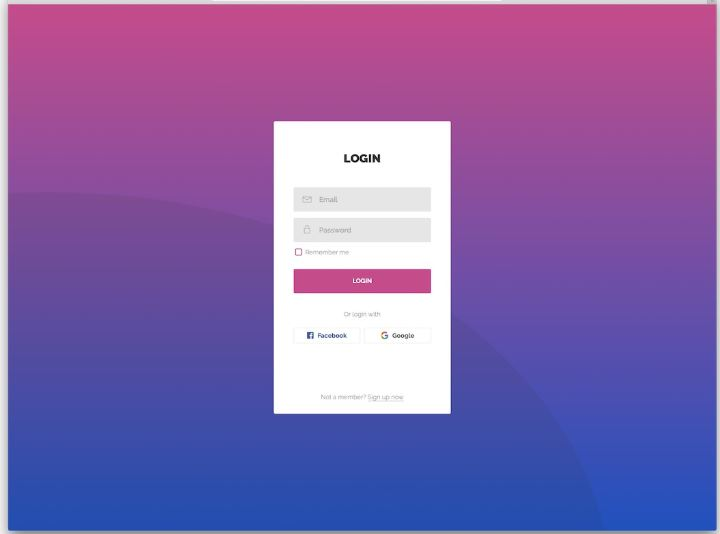
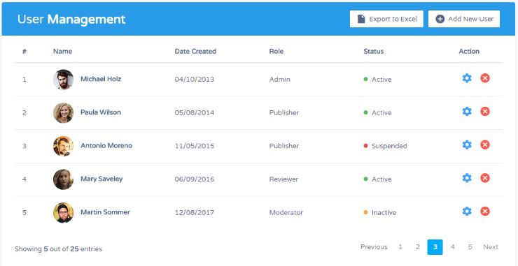
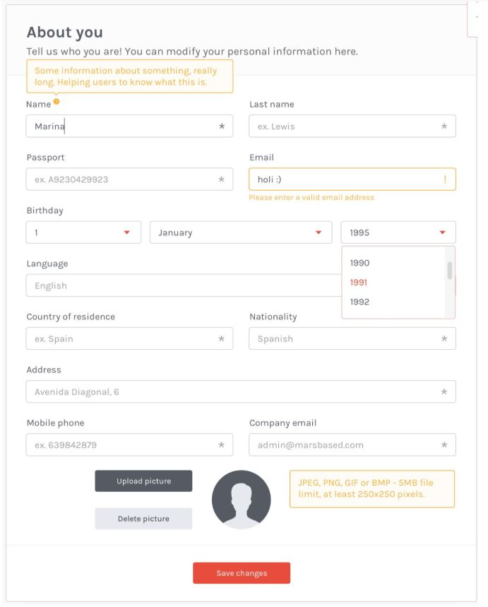

# Primeiro-projeto---HTML-CSS-e-JS-FRONT-END

Front-end do projeto criado para consolidar o aprendizado básico sobre HTML, CSS e JS

REGRAS DA TELA:

1 - Criar uma tela de login HTML + CSS igual modelo

O botão login deve levar ao item 2 somente se usuário e senha forem exatamente "admin" e "senha@2020". 

Caso contrário deve exibir um alerta com a mensagem: "Usuário ou senha inválidos".

O layout deve respeitar EXATAMENTE o modelo. O background é o único que pode ser diferente.

Fonte do texto, tamanho da fonte, negrito ou não, alinhamento dos componentes e botões devem ser replicados.

2 - Criar tela de dashboard igual modelo

Todos os botões devem ser replicados.

Cores, alinhamentos, fontes, e demais detalhes devem ser respeitadas.

A foto "redonda" deve ser feito o efeito em CSS.

A paginação "Previous" e "Next" é meramente visual.

Os itens da tabela devem ser carregados de a partir de um Array em Javascript.

A Action "X" deve excluir a linha em questão, utilizando HTML + Javascript.

A Action Engrenagem é meramente ilustrativa.

No meu projeto eu adicionei um botão para editar as informações, esse botão é opcional.

O botão "Add new user" irá chamar a tela abaixo descrita no item 3.

3 - Criar formulário de edição conforme modelo

Replicar toda a tela obedecendo as regras já definidas nos itens anteriores.

Utilizar bibliotecas de validação de formulário com alerta em campos preenchidos de modo incorreto, conforme ilustração.

Telefone: usar máscara no campo. Usuário deve digitar somente números e o formulário deve "mascarar"o campo no formato (XX) XXXXX XXXX.

Obrigatoriedade de 8 ou 9 dígitos numéricos. Não permitir digitara letras.

E-mail: obrigatório o campo de e-mail ser no formato xxxx@xxx.xxx. Ou seja, tem que ter @ e depois do arroba, um . (ponto) alguma coisa.

Campo obrigatórios: nome, sobrenome, email, mobile phone, birthday e language. 

A tela de formulário deve ser chamada a partir do clicar no botão "Add new user" do item anterior

